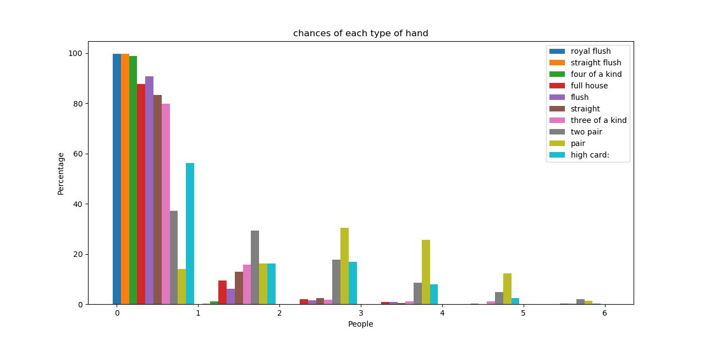

# Poker_Analysis

Monte Carlo method that simulates rounds of poker in order to figure out the statistics for the number of each type of hand

The number of players can be adjusted

The simmulation can be done with given or random community cards

